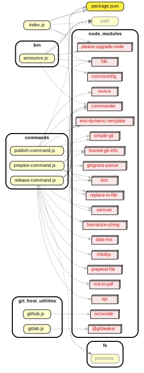

### CONTRIBUTING TO ANNOUNCE

#### TABLE OF CONTENTS
- [Getting the Code](#getting-the-code)
- [Setting up the Environment](#setting-up-the-environment)
  - [Git Configuration](#setting-up-git-config-locally)
  - [Generating the GPG key](#generating-the-gpg-key)
- [Extending the Code](#extending-the-code)
- [Building and Testing](#building-and-testing)

#### GETTING THE CODE

```
git clone https://github.com/twyr/announce
cd announce
npm i && npm up
```

#### SETTING UP THE ENVIRONMENT

##### Generating the GPG Key

[Twy'r Announce](https://github.com/twyr/annouce) requires that every commit be signed before it is accepted for merging into the main branch prior to release.

All contributors are expected to create a GPG Key and use it to sign all their commits during the development process.
At the very minimum, all *Pull Requests* are expected to be signed by the contributors' GPG Key prior to being accepted.

Please follow the Github guide on [Managing commit signature verification](https://help.github.com/en/github/authenticating-to-github/managing-commit-signature-verification) for instructions on how to get this done.

##### Setting up Git Config Locally

```
git config commit.gpgsign true

git config trailer.sign.key "\nSigned-off-by: "
git config trailer.sign.ifmissing add
git config trailer.sign.ifexists doNothing
git config trailer.sign.command 'echo "$(git config user.name) <$(git config user.email)>"'

git config user.name "YOUR NAME"
git config user.email "your.name@twyr.com"
git config user.signingKey "GPG Key Id"
```

#### EXTENDING THE CODE


- [ ] TODO: Added along with the commands

#### BUILDING AND TESTING

| Operation | NPM Script / Command  |
| --- | --- |
| Building Everything | npm run build |
| Collecting (mostly useless) Statistics | npm run stats |
| Generating Documentation | npm run docs |
| Linting | npm run lint |
| Running the Tests | npm run test |
|   |   |
